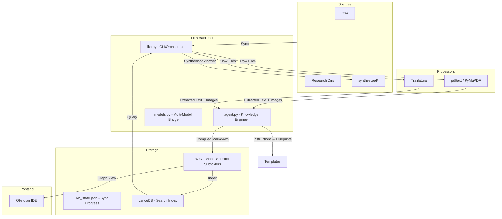

# LKB Architecture & Data Flow

This document provides a detailed technical overview of the LLM Knowledge Base (LKB) system, illustrating how raw data is transformed into an agentically maintained information graph.

---

## 🏗 System Architecture

The LKB follows a "Knowledge Compiler" pattern, treating information as a compiled asset.

---

## 🔄 Data Flow: Stage-by-Stage

### 1. Synchronize (`sync`)
The **Sync** stage is the primary "Compilation" pass.
1.  **Crawl:** The system scans all directories defined in `config.yaml`.
2.  **Filter:** It checks `.lkb_state_<model>.json` and skips files already processed.
3.  **Extract:**
    *   **Text:** `pdftext` (visual-aware) or `fitz` (fallback).
    *   **Images:** `PyMuPDF` rips figures/tables into `attachments/<paper_name>/`.
4.  **Compile:** The LLM receives the text, paper metadata, and a list of available images.
5.  **Weave:** The LLM generates a structured `.md` file, agentically inserting `![[image]]` tags and `[[Related Concepts]]`.
6.  **Organize:** Files are saved to `wiki/<model>/<topic>/<filename>.md` using deterministic source-based naming.

### 2. Index (`index`)
The **Index** stage prepares the knowledge for high-speed retrieval.
1.  **Recursive Scan:** Iterates through every `.md` file in the current model's wiki.
2.  **Embed:** Each article's content is embedded via a local Ollama embedding model (`nomic-embed-text` by default, `embedding:` section in `config.yaml`), truncated to a safe input length (`MAX_EMBED_CHARS` in `tools/search_engine.py`) to stay within the embedding model's own context window. A file whose embed call fails is skipped (logged, not fatal) rather than aborting the whole index.
3.  **LanceDB Ingest:** Builds an explicit pyarrow schema (title/content/path/vector, with the vector as a fixed-size float32 list sized to the embedding model's actual output dimensionality) and overwrites the local `wiki_articles` table in the model-specific LanceDB instance.
4.  **No ANN index built by default:** `table.create_index()` is never called, so `search()` does an exact brute-force k-NN scan (confirmed via `explain_plan()`) — correct and effectively instant at this corpus's current scale (~120 articles), but would need an explicit IVF-PQ/HNSW index (`num_partitions` on the order of `sqrt(N)`) if the corpus grows into the thousands.

### 3. Query (`query`)
The **Query** stage enables the "Researcher" persona.
1.  **Search:** Embeds the query with the same local embedding model, then performs semantic vector search (L2 distance) against the LanceDB index — not a keyword/substring filter.
2.  **Context Construction:** Retrieves the top-K most relevant compiled articles.
3.  ~~**Synthesis:** The LLM answers the user's question based *strictly* on the retrieved wiki context.~~ **Not implemented.** `query` currently returns raw search results (title/path/content excerpt); there is no LLM synthesis step over the retrieved context.
4.  ~~**Self-Synthesis Loop:** High-value answers are automatically written to the `synthesized/` directory...~~ **Not implemented.** No write-back to `synthesized/` happens automatically. (See `synthesized/local_llm_hallucination_on_long_documents.md` and `synthesized/vector_search_and_ann_indexing.md` for examples of what this directory holds today — manually authored notes, not LLM-synthesized query answers.)

### 4. Health Check (`health`)
The **Health** stage is an LLM-driven audit.
1.  **Link Analysis:** Identifies "Broken Links" (concepts mentioned but not existing as files) and "Orphans."
2.  **Gap Detection:** The LLM analyzes existing topics and suggests 3-5 new research directions to fill knowledge voids.

### 5. Clean (`clean`)
The **Clean** stage ensures vault integrity.
1.  **Pattern Match:** Removes files with "Extraction Error" or "Missing Content" in the filename.
2.  **Size Gate:** Purges files < 200 characters (typically result from parsing failures).

---

## 🧠 Core Design Principles

1.  **Files as API:** No proprietary database locks. Your data is always readable Markdown.
2.  **Model-Agnostic Isolation:** Separate wikis and states for Gemini vs. Ollama allow for objective performance comparison.
3.  **Deterministic Naming:** Prevents duplicate articles when switching models or re-processing.
4.  **Quality Gate:** Two-stage logic prevents "polite" LLM errors from polluting the Obsidian graph.
